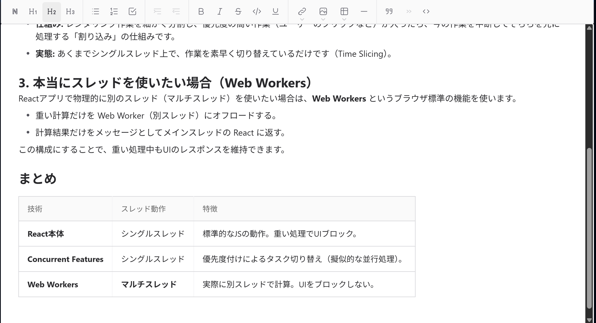

# Wysimark-lite

React用のモダンでクリーンなリッチテキストエディタ。CommonMarkおよびGFM Markdown仕様に対応しています。

wysimark ( https://github.com/portive/wysimark ) をフォークし、より軽量で使いやすくなるよう改修したものです。

オリジナルのwysimarkの作者であるportiveに感謝します m(_ _)m

[English README](README.md)

## デモ

Storybookでエディタを試すことができます:
https://takeshy.github.io/wysimark-lite



## 使い方

### Reactコンポーネントとして使用

```bash
npm install wysimark-lite
```

```tsx
import { Editable, useEditor } from "wysimark-lite";
import React from "react";

const Editor: React.FC = () => {
  const [value, setValue] = React.useState("");
  const editor = useEditor({});

  return (
    <div style={{ width: "800px" }}>
      <Editable editor={editor} value={value} onChange={setValue} />
    </div>
  );
};
```

### エディタオプション

`useEditor` フックは以下のオプションを受け付けます:

```tsx
const editor = useEditor({
  // Rawマークダウン編集モードを有効化 (デフォルト: true = 無効)
  disableRawMode: false,

  // ハイライト機能を有効化 (デフォルト: true = 無効)
  disableHighlight: false,

  // タスクリスト/チェックリストを無効化 (デフォルト: false)
  disableTaskList: true,

  // コードブロックを無効化 (デフォルト: false)
  disableCodeBlock: true,
});
```

| オプション | デフォルト | 説明 |
|--------|---------|-------------|
| `disableRawMode` | `true` | `false`にすると、WYSIWYGとRawマークダウン編集を切り替えるボタンが表示される |
| `disableHighlight` | `true` | `false`にすると、ツールバーにハイライトボタンが表示される。ハイライトはMarkdownで`<mark>text</mark>`として保存される |
| `disableTaskList` | `false` | `true`にすると、タスクリスト（チェックリスト）ボタンがツールバーから非表示になる |
| `disableCodeBlock` | `false` | `true`にすると、コードブロックボタンがツールバーから非表示になる |

### 画像アップロード機能付き

`onImageChange` コールバックを指定することで、画像ファイルのアップロード機能を有効にできます:

```tsx
import { Editable, useEditor } from "wysimark-lite";
import React from "react";

const Editor: React.FC = () => {
  const [value, setValue] = React.useState("");
  const editor = useEditor({});

  const handleImageUpload = async (file: File): Promise<string> => {
    // サーバーにファイルをアップロードしてURLを返す
    const formData = new FormData();
    formData.append("image", file);
    const response = await fetch("/api/upload", { method: "POST", body: formData });
    const { url } = await response.json();
    return url;
  };

  return (
    <div style={{ width: "800px" }}>
      <Editable
        editor={editor}
        value={value}
        onChange={setValue}
        onImageChange={handleImageUpload}
      />
    </div>
  );
};
```

`onImageChange` を指定した場合:
- 画像ダイアログでURL入力とファイルアップロードを切り替えるラジオボタンが表示されます
- エディタに画像ファイルを**ドラッグ＆ドロップ**して、カーソル位置に挿入できます

### 直接初期化

HTML要素に対して直接エディタを初期化することもできます:

※ Rails importmapを使用している場合は、importmap.rbに以下を追加してください。
※ @latestはwysimark-liteの最新バージョンです。特定のバージョンを指定する場合は、@latestを使用したいバージョンに置き換えてください。
```
pin 'wysimark-lite', to: 'https://esm.sh/wysimark-lite@latest?deps=react@19.2.0,react-dom@19.2.0'
```

```html
<div id="editor"></div>
<script type="module">
  import { createWysimark } from "wysimark-lite";

  const editor = createWysimark(document.getElementById("editor"), {
    initialMarkdown: "# Hello Wysimark\n\nここに入力してください...",
    onChange: (markdown) => {
      console.log("Markdownが変更されました:", markdown);
    },
  });
</script>
```

## 機能

- **原文の保持**: 初期読み込み、カーソル移動、未編集でのVisual／Raw切り替えでは `onChange` を発火しません。元のNBSPとリンク参照定義を保持し、定義は読み取り専用のソースブロックとして表示します。統一されたLF・CRLF・CRを維持し、混在した改行は編集時に最初の形式へ統一します。
- **折りたたみ時の書式表示**: 有効な修飾のアイコンをボタン内に表示し、ツールチップにも名称を表示します。

- **モダンなデザイン**: Reactアプリケーションにシームレスに統合できる、クリーンでモダンなインターフェース
- **Markdownモード**: WYSIWYGモードと生のMarkdown編集モードを切り替え可能（`disableRawMode: false`で有効化）
- **ハイライト機能**: テキストを`<mark>`タグでハイライト（`disableHighlight: false`で有効化）
- **画像アップロード対応**: `onImageChange` コールバックを指定すると、ファイル選択やドラッグ＆ドロップで画像をアップロード可能
- **コードブロックの言語指定**: 言語ラベルをクリックして任意の言語名を入力可能
- **使いやすいインターフェース**:
  - シンプルなツールバー（トグルボタンでクリックして書式を適用/解除）
  - Markdownショートカット（例: `**` で**太字**、`#` で見出し）
  - キーボードショートカット（例: `Ctrl/Cmd + B` で太字）
  - 日本語ローカライズされたUI（ツールバーとメニュー項目が日本語表示）
- **リンク編集の強化**:
  - リンクダイアログでリンクテキストとツールチップを直接編集可能
  - 挿入ダイアログと編集ダイアログの両方でテキストとツールチップフィールドをサポート
- **リスト機能の強化**:
  - ネストされたリストをサポート（複数レベルの階層リストを作成可能）
  - 階層内で異なるリストタイプを混在可能
- **テーブル編集の強化**:
  - テーブルセル内で `Enter` キーを押すと改行（ソフトブレーク）を挿入
  - `Shift+Enter` で次のセルに移動
  - 最後のセルで `Tab` を押すとテーブルを抜けて新しい段落を作成
- **スマートブロック分割**: 複数行のブロックに見出し/段落スタイルを適用する際、選択された行のみが変換される
- **カーソル位置の保持**: 要素タイプの変換後（例: 段落から見出しへ）もカーソル位置が維持される

## キーボードショートカット

エディターにフォーカスがあるときに使えます。ツールバーやメニューにもキーを表示します。
見出し、文字装飾、リスト、コードブロックは同じキーで適用・解除できます。

| 操作 | Mac | Windows / Linux |
| --- | --- | --- |
| 標準段落に戻す・文字装飾を解除 | Cmd+Option+0 | Ctrl+Shift+0 |
| 見出し1〜6 | Cmd+Option+1〜6 | Ctrl+Shift+1〜6 |
| 太字 / 斜体 / 下線 | Cmd+B / I / U | Ctrl+B / I / U |
| 取り消し線 | Cmd+Option+K | Ctrl+Shift+K |
| インラインコード | Cmd+J | Ctrl+J |
| ハイライト（有効時） | Cmd+H | Ctrl+H |
| リンク編集 | Cmd+K | Ctrl+K |
| 番号付き / 箇条書き / タスクリスト | Cmd+Option+7 / 8 / 9 | Ctrl+Shift+7 / 8 / 9 |
| リストのインデント / 解除 | Tab / Shift+Tab | Tab / Shift+Tab |
| 引用のインデント / 解除 | Cmd+Option+. / , | Ctrl+Shift+. / , |
| コードブロックの適用・解除 | Cmd+Shift+N | Ctrl+Shift+N |
| コードブロックの適用・解除（従来のキー） | Cmd+Option+バッククォート（`） | Ctrl+Shift+バッククォート（`） |
| 水平線を挿入 | Cmd+Option+- | Ctrl+Shift+- |
| 表を挿入（3列×2行） | Cmd+Option+T | Ctrl+Shift+T |
| 段落内で改行 | Shift+Enter | Shift+Enter |

表内では以下も使えます。

| 操作 | Mac | Windows / Linux |
| --- | --- | --- |
| 次 / 前のセル | Tab / Shift+Tab | Tab / Shift+Tab |
| 次のセル（末尾では行を追加） | Shift+Enter | Shift+Enter |
| セル内で改行 | Enter | Enter |
| セルの内容を選択（コードブロック内ではブロックを選択） | Cmd+A | Ctrl+A |
| 行を下 / 上に挿入 | Cmd+Enter / Cmd+Shift+Enter | Ctrl+Enter / Ctrl+Shift+Enter |
| 列を左 / 右に挿入 | Cmd+Option+[ / ] | Ctrl+Shift+[ / ] |
| 行を削除 | Cmd+Backspace | Ctrl+Backspace |
| 列を削除 | Cmd+Shift+Backspace | — |
| 表を削除 | Cmd+Option+Backspace | Ctrl+Shift+Backspace |

タスクリスト、コードブロック、ハイライトを無効にしている場合、それぞれのショートカットも無効です。

## ブラウザサポート

- Google Chrome
- Apple Safari
- Microsoft Edge
- Firefox

## 必要要件

- React >= 17.x
- React DOM >= 17.x

## 開発

### Lint

TypeScript/TSX ソースの ESLint 実行コマンド:

```bash
npm run lint
```

## ライセンス

MIT
